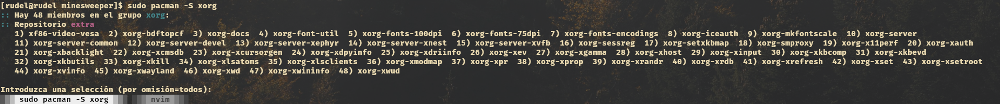

# instalación del sub sistema de linux 

## Activar el hipervisor de windows 
El hipervisor 

- Ve al panel de control
- una vez ahí busca entra a "Programas y Características"
- cuando estes ahí busca y presiona el botón "Activar o desactivar caracteristicas de windows"
- Te saldra una lista, en esa lista buscarás la casilla Hyper-V
- Una vez la localices marcaras la casilla y le daras a aceptar
- Esto activara ciertos procesos y al final te pedira reiniciar tu computadora

## Instalar WSL (windows subsystem linux)
El WSL es una herramienta que nos permite virtualizar o simular un sistema linux (distrubución)
dentro de nuestro sistema operativo windows, esto con el fin de correr programas y 
comandos propios de linux y la distrubución que hayamos instalado

- Buscaras "Windows powershell"
- Le daras click a "ejecutar como administrador"
- una vez te salga una pantalla similar a esta 
- y escribiras "wsl --install" y le darás a la tecla Enter, esto te descargara wsl, asi que espera
- una vez instalado necesitaras descargar la distrubución, en este caso instalaremos Arch linux
- dentro de la misma Windows powershell ahora escribiras "wsl.exe --install Arch Linux" y le daras a Enter 

# instalación de dependencias en Arch Linux
Arch maneja por defecto un gestor de paquetes llamado Pacman
este gestor actua principalmente como lo haria un instalador en windows 
pero por comandos, tomando las aplicaciones de los llamados repositorios (repos)
que no son más que grandes bases de datos con muchos programas

- Buscaras "Terminal"
- Le daras click a ejecutar 
- Una vez ahí escribe wsl y le darás a la tecla Enter
- ya estas dentro del sistema Arch Linux (para salir solo dale a exit y te devolvera a tu terminal normal)
- Antes de instalar cualquier cosa hay que configurar los repos, escribe "pacman -Sy", dale a Enter y esperas
- Ahora si escribiras el siguiente comando "pacman -S xorg gflw  mesa-utils make bear git gcc"
- en xorg te saldrá algo similar por no decir igual a esto, tu solo dale a enter 

# Comandos básicos de arch
- clear: limpiará la pantalla
- cd /ruta/de/folder : te moveras por los folders o carpetas de tu sistema (puedes darle a tab para que auto complete)
- pwd: te dirá en que ruta o que posición estas de tus carpetas 
- ls: listará las carpetas y archivos de tu posición actual

## Ejemplo para correr el código del busca minas 

- cd Downloads/
- git clone https://github.com/MiguelVRRL/Busca-Minas.git
- cd Busca-Minas 
- bear -- make 
- make all (dale a scape para salir de la ventana o a la x)
- exit (para salir de windows y ya cierras la terminal nomás dandole a la x)

